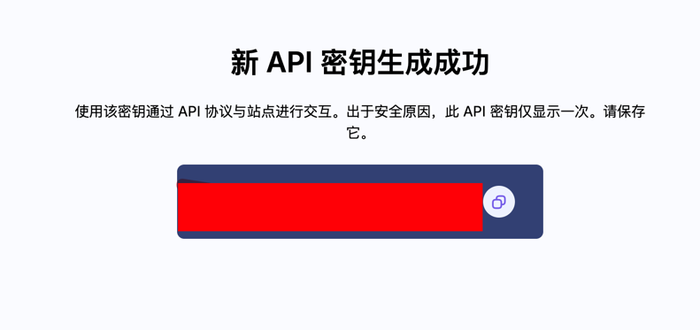
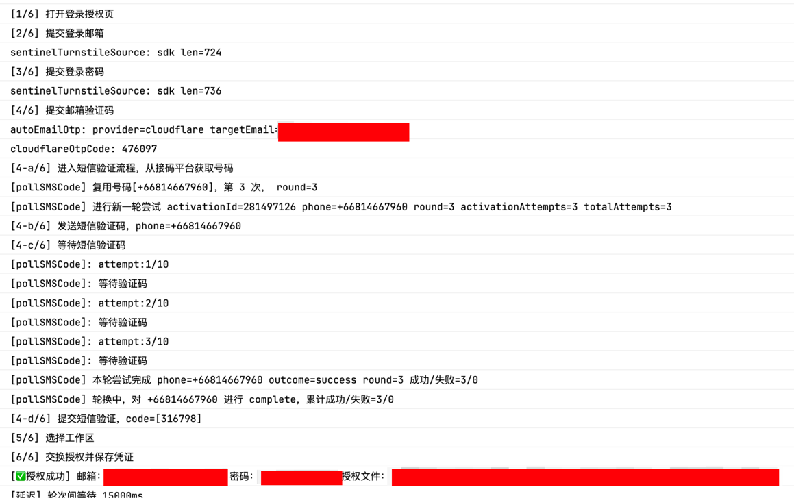

# ADD_PHONE 配置接码平台

目前仅支持 [HeroSMS](https://hero-sms.com/cn)。


这份教程用获取 HeroSMS API Key。

适用场景：

- 你想让程序自动对接接码平台，完成 AddPhone 验证

目标：

- 获取一份可用的 HeroSMS API Key


### Step1: 完成注册并登录 HeroSMS

这部分请按网站指引完成
 
### Step2：获取 APIKey

进入：https://hero-sms.com/cn/profile/safety


点击生成 API Key，系统会发送一封验证邮件至注册邮箱


进入邮箱查看，可以看到一封名为 「更改 HeroSMS API 密钥」的邮件，其中包含获取新 APIKey 的链接。

如下：


点击链接即可获取最终的 APIKey




### Step3：充值

使用前请保证有充足余额，按需充值。 支付宝/微信渠道最低充值 `3$`。

### Step4: 使用

在 config.example.json 中填入

```json
{
  "heroSMSApiKey": "your-api-key"
}
```

### Step4：效果



> [!Note]
> 每个号码可以使用 1 - 3 次，超出会引发 phone_max_usage_exceed 错误。
> 目前固定选用泰国，$0.05，尚未进行配置化，如需变更请手动在 `src/sms/index.ts` 中进行更改